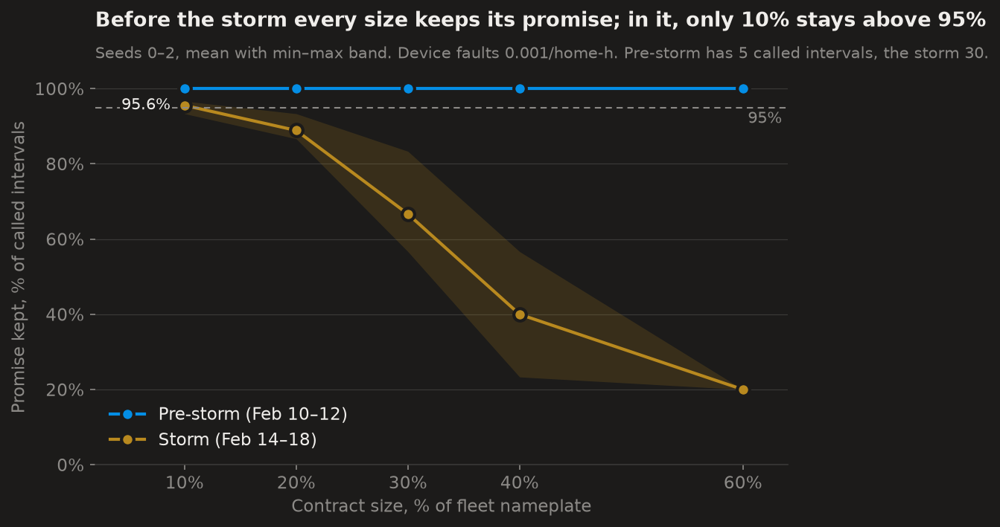
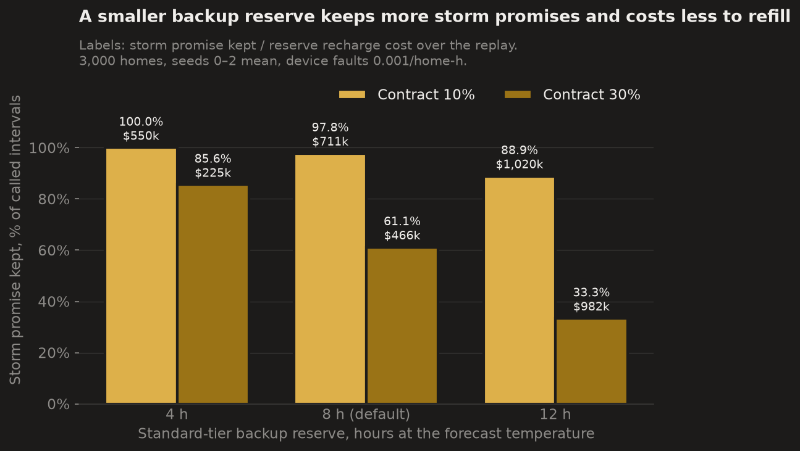
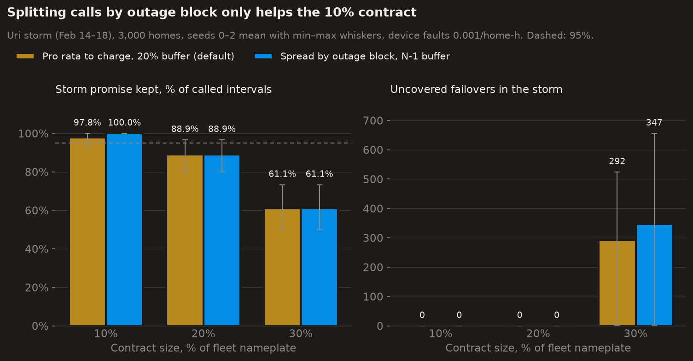

# Simuritor

**Before a home-battery fleet signs its next utility contract, replay the worst week in Texas grid history against it.**

Built in 36 hours for the Base Power × AITX hackathon (tracks: **Orchestration** and **Open Grid Data**).

> **How much can a Base-sized fleet safely promise a utility if Winter Storm Uri happens again?**
>
> - In a normal winter week, every size we tested up to **60%** of its power keeps its calls.
> - In Uri, only **15%** clears the bar (95.6% of storm calls kept; the bar is 95%).
> - The safe promise shrinks **4×**, and it's *energy*, not failover speed, that runs out: every failover is covered and calls still miss.



<!-- TODO: Loom link + a screenshot of the map at Feb 15 03:00 -->

## What it is
Simuritor replays **Feb 10–20, 2021** against **3,000 home batteries on real Austin homes**, one 15-minute ERCOT settlement interval per tick:
- 3,000 homes × 12 kW ≈ 36 MW, about the size of Base's 40 MW Austin Energy deal;
- homes sit on real OpenStreetMap residential buildings;
- real ERCOT prices, Austin temperatures and the grid-emergency timeline drive everything;
- rolling outages cut **whole neighbourhoods at once**, like real circuits.

Every battery serves two promises:
- **To the homeowner:** keep the lights on for *N* hours of outage (a backup reserve, tiered: none / 8 h / 16 h for medical homes).
- **To the utility:** deliver *X* MW when called: at most once a day, 06:00–22:00, 1.5 h. That's a capacity contract shaped on Base's public utility deals.

A deterministic dispatch policy keeps both promises. Failover runs on a **seconds timeline inside each tick**:
- batteries drop out mid-call (device faults, or a neighbourhood being cut);
- the controller detects them from 2-second heartbeats;
- it moves their load onto the healthy homes with the most spare capacity.

**The tool part.** A live map and HUD show all of this. The **Contract terms** panel lets you switch scenarios and policies, change backup hours, and **Find qualifying contract**: in seconds it replays every size from 5–60% against Uri and a normal week, shows the largest that clears the bar in each, and lets you apply it to the replay.

## Findings
3,000 homes; means over seeds 0–2 unless noted. Reproduce with `scripts/sweep.py` and `scripts/plots.py`. Full tables are in [`docs/notes.md`](docs/notes.md).

**1. The safe contract shrinks 4× in a Uri.** Promise kept (called intervals delivered within 2%), device faults 0.001/home-hour:

| Contract (% of fleet power) | Normal winter week | Uri storm (Feb 14–18) |
|---|---|---|
| 10% | 100% | **97.8%** |
| 20% | 100% | 88.9% |
| 30% | 100% | 61.1% |
| 60% | 100% | 23.3% |

The "safe contract" (the app's **Find qualifying contract**) is the largest tested size keeping ≥ 95% of called intervals, averaged over three seeds, with no more medical homes running out than with no contract. By that rule: **15% in Uri (95.6% kept), 60% in the normal week** (the largest size tested, so a floor, not a ceiling). Sizes step by 5%. The normal week (Feb 21–27, 2022) and Uri's pre-storm days each contain a single call, so read "100%" there as comfortable, not proven.

**2. Energy runs out before failover does.**
- Failover holds: at 10%, **1,344 failovers** in the replay, **0 uncovered**, covered in **5 s** (warned) / **11 s** (silent) against a 60 s target. Those times come from the modelled heartbeat and reassign delays, not measured device latency.
- At 20% there are still **no uncovered failovers**, yet 11% of storm calls miss. The fleet simply doesn't have the energy.
- The backup reserve grows as it gets colder, calls come at the same time, and both draw on the same kWh. Correlated neighbourhood cuts (a rotation block is ~540 homes) only beat failover from 30% up.

**3. The backup promise is the biggest lever.** At 30%:

| Standard backup | Storm promise kept |
|---|---|
| 4 h | 85.6% |
| 8 h | 61.1% |
| 12 h | 33.3% |

A 4 h reserve moves Uri's safe contract from 15% to **25%**. Every hour of backup promised to homes is energy you can't promise the utility.



**4. Contract terms are priceable.** Safe contract in Uri:

| Terms | Safe in Uri |
|---|---|
| Default | 15% |
| No calls when a severe storm is forecast (Austin Energy's own program practice) | 20% |
| Standard backup 4 h | 25% |
| Naive policy (sell ≥ $1,000, buy ≤ $30) | **no size is safe** |

**5. Contract-aware dispatch halves the damage.** Same fleet, 10% contract, seed 0:

| Policy | Promise kept | Penalties | Dark home-hours (ran out) |
|---|---|---|---|
| Naive price rules | 8.5% | $259k | 39,826 |
| **ContractPolicy** | **100%** | **$77** | **21,827** |

**6. What we tested and ruled out.**
- **Spreading calls across outage blocks** (Kubernetes-style anti-affinity, with an N-1 buffer) only helps at 10%: 97.8% → 100%. At 20–30% it changes nothing, because energy, not failover, is the limit. We'd expect it to matter in a short, sharp load shed with full batteries. That's the next crisis to add.
- **The $1,000/MWh call trigger** is ours (programs say "peak demand" without a number). With $500 or $3,000 the results barely move.
- **Pre-charging before the storm** made no difference; the fleet fills cheaply on Feb 10 anyway.



**Honest limits:**
- **Money:** the sim isn't a business P&L. It doesn't model Base's retail revenue or the homes' normal grid load, and the capacity payment is a placeholder.
  - What it does show: at Uri prices, **keeping homeowners' backup and staying ready for the next call both mean buying energy at ~$9,000/MWh**, far more than any capacity fee.
  - The policy also buys the next call's energy too early: right after the day's call, although no call can come until tomorrow. That's the next fix.
- **Some medical homes always run out (26–37 of 300).** They sit on feeders that were never restored for ~4 days, and no 16 h reserve lasts that long. That's a sizing limit, not a dispatch one.
- **The controller knows a bit too much:** planning uses the actual temperatures as a perfect forecast, and failover won't pick a stand-in home that drops out later in the same 15 minutes. Forecast error and cascading stand-in failures are next.
- **Evidence:** three fleet seeds against one historical crisis. The "safe contract" is the largest size that clears our bar in this model, not a guarantee for a real fleet.
- **The outage model:** feeders are a k-means stand-in for the real distribution network, and the outage schedule (4 h off / 6 h on, 10% never restored) is our assumption.

## How it works

```
 ERCOT prices (LZ_AEN, 15-min)   Austin temps (hourly)   EEA timeline     OSM homes
                 \                        |                  /               |
                  └──────── scenario data source (Frame per tick) ─── fleet (seeded)
                                          │
 faults: rolling outages by feeder + device faults ─┤
 commitment: UtilityContract (calls, caps, clauses) ┤
                                          ▼
                     Sim.step()  (numpy, 3,000 homes, ~1 ms/tick)
            reserve(tier, forecast) → ContractPolicy.decide → physics
            → failover timeline inside the tick (seconds, heartbeats)
            → accounting (promise kept, penalties, money split)
                                          │
                             serialize.py (the only edge)
                  websocket /ws?terms…  (init + tick)   GET /api/safe-contract
                                          ▼
      React + MapLibre night map (dots → 3D houses) · counters · chart · failover log · contract terms
```

- **Swappable seams:** data source/scenario, policy, faults, commitment source. Plug in a policy, contract terms or a crisis and replay it.
- **One wire contract.** `backend/schema.py` (Pydantic) generates the JSON schema and the frontend's TypeScript types, and a test fails if they drift.
- **ContractPolicy**, per home, per tick:
  1. off grid: back up the house (or go dark if the homeowner opted out);
  2. protect the reserve (tier × forecast temperature);
  3. split the utility call;
  4. hold a buffer for failover;
  5. stay ready for the next call;
  6. keep the rest (headroom).
- **Why no LLM:** we started with a model in the loop for "judgment calls" and dropped it. Dispatch works as deterministic rules; the hard part is keeping promises when hardware fails.

**Performance:**

| What | Time |
|---|---|
| Whole 10-day replay, 3,000 homes, headless | ~1 s |
| Same at 10,000 homes | ~3 s |
| Live streaming at 3,000 homes | 56 ticks/s |
| The insight sweep (102 runs) | ~19 s |
| "Find qualifying contract" (78 replays) | ~12 s cold; the default terms are precomputed at startup |

**Tests:** 241.

Full design and every assumption: [`docs/dispatch-design.md`](docs/dispatch-design.md).

## Data: real vs simulated
**Real:**
- ERCOT real-time prices for `LZ_AEN` (read from ERCOT; `scripts/fetch_prices.py` notes a gridstatus quirk we worked around);
- hourly Austin temperatures (Open-Meteo archive);
- ERCOT's EEA timeline;
- residential building locations (OpenStreetMap);
- a normal winter week (Feb 21–27, 2022) from the same sources.

**Simulated (seeded, reproducible):**
- **batteries:** 25 / 39.2 kWh, 12 kW;
- **backup tiers:** 10% none, 80% standard (8 h), 10% critical (16 h);
- temperature-driven household load;
- **rolling outages by feeder:** 4 h off / 6 h on, 10% never restored;
- **device faults:** 80% transient, 20% hard.

Base's fleet data is private. Each assumption is listed with its basis, or marked ⚠ as ours, in the [assumptions table](docs/dispatch-design.md#assumptions-and-sources).

**Public facts the contract model is built on:**
- **Base's utility deals:**
  - [Austin Energy](https://www.publicpower.org/periodical/article/austin-energy-enters-agreement-with-base-power-deploy-40-mw-residential-battery-storage): 40 MW, about 1.5 h at full power.
  - [GVEC](https://www.gvec.org/gvec-x-base-power/): events "not to exceed one event per day on average"; members keep a minimum backup reserve.
- **[Austin Energy Power Partner Battery](https://austinenergy.com/energy-efficiency/rebates-incentives/residential/appliances-equipment/pp-battery):**
  - events 6am–10pm;
  - never below 20%;
  - typically no events before severe storms;
  - ≤ 40 a year excluding grid emergencies.
- **[ERCOT ADER Phase 3](https://www.ercot.com/files/docs/2025/06/16/4.3-Aggregate-Distributed-Energy-Resource-ADER-Pilot-Project-Phase-3.pdf):**
  - 2-second telemetry (our heartbeat);
  - per-battery minimum SoC;
  - 15-minute settlement.

**Stated simplifications:**
- **Promise judging:** promises are judged per 15-minute settlement interval (ADER re-targets every 5 minutes; utility contracts measure performance under private terms).
- **Counterfactual:** neither Base nor ADER existed in 2021, so this is a what-if replay.

## Run it
Requires [`uv`](https://docs.astral.sh/uv/) and Node. No API keys or `.env` needed; all data ships in `data/` (the basemap needs internet). The app needs the backend running; there's no static deploy.

```bash
uv sync
uv run uvicorn backend.app:app --port 8000        # backend
cd frontend && npm install && npm run dev          # http://localhost:5173
```

The replay runs with the terms in the URL, e.g. `/?policy=naive&contract=0.1`. The Contract terms panel writes them for you.

In the app: **Play / Pause**, speed (1–32 ticks/s), **Reset**, and **Hide panels** (or **H**) for a bare map. Panels drag, resize and expand; on a phone they stack. Contract edits are drafts until **Apply & reset**. **Find qualifying contract** opens both scenarios side by side, and **Apply** loads a result into the replay. A walkthrough is in [`docs/demo.md`](docs/demo.md).

Headless:
```bash
uv run python -m scripts.run_replay --contract-size 0.1                  # daily summary
uv run python -m scripts.run_replay --policy naive --contract-size 0.1   # the baseline
uv run python -m scripts.sweep && uv run python -m scripts.plots         # results/sweep.csv, docs/img/
uv run pytest
```

## Repo layout
```
backend/   data.py · sim.py · policy.py · commitment.py · failover.py · faults.py · safe_contract.py
           schema.py (wire contract) · serialize.py (the only edge) · app.py (FastAPI: /ws, /api/safe-contract)
frontend/  React + MapLibre + Recharts HUD (types.ts generated from schema.py)
scripts/   run_replay · sweep · plots · fetch_prices · fetch_temps · fetch_homes · gen_types
data/      prices, temperatures, home sites (parquet)   results/ sweep.csv   docs/ design, notes, charts
```

## Credits
- Map data © [OpenStreetMap](https://www.openstreetmap.org/copyright) contributors (ODbL); basemap tiles by [OpenFreeMap](https://openfreemap.org).
- Price data: ERCOT. Weather: [Open-Meteo](https://open-meteo.com).
- Simuritor is a hackathon project. It isn't a Base Power product, and it uses no Base data, assets or branding.
